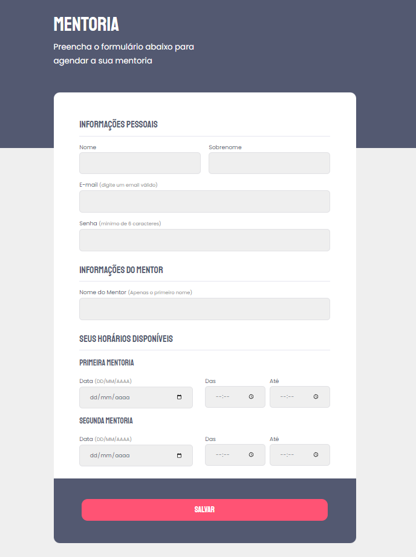

# Formulário de Mentoria / Mentorship form

# Sobre o projeto / About the project

Neste projeto foi criado uma página de para exibir o que foi aprendido sobre formulários.

This project was created to show what was learned about forms.

## Layout

# Tecnologias utilizadas / Tech stack
- HTML
- CSS
- Figma
- Git & Github

## Autor

